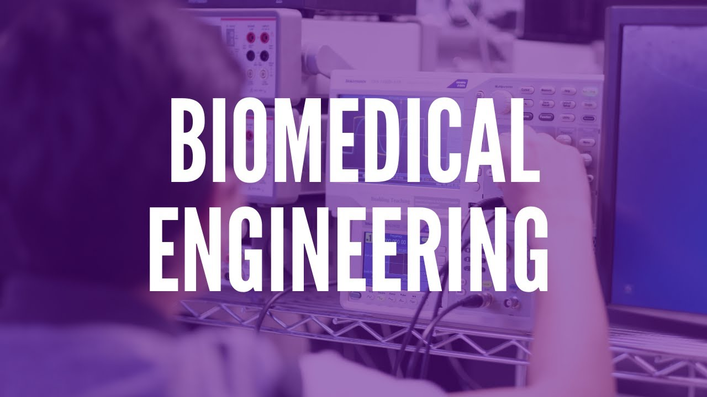

# Hello! My name is Jarett Dewbury 👋

My name is Jarett Dewbury and I am a **Biomedical Engineering** undergraduate at the University of Waterloo

📖 I am looking to explore a variety of topics ranging from brain-machine interfaces, deep learning, machine learning, 
    artificial intelligence, neural engineering, software engineering, and research exploring the intersection of these fields! 

🧠 I am currently working on and researching SSVEP-based brain computer interface models 

🏒 Outside of academia, my passions focus around ice hockey, bike rides, and all things food.

