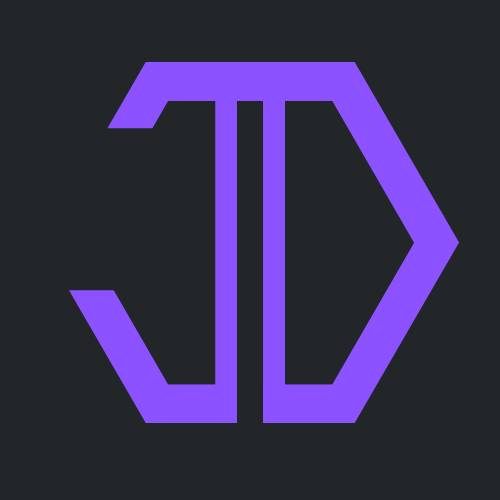

# Hello! My name is Jarett Dewbury

I am a **Biomedical Engineering** undergraduate at the University of Waterloo. 
I am looking to explore a variety of topics ranging from brain-machine interfaces, deep learning, machine learning, 
artificial intelligence, neural engineering, software engineering, and research exploring the intersection of these fields! 

🧠 I am currently researching and developing SSVEP-based brain computer interface models!

🏒 Outside of academia, my passions focus around ice hockey, bike rides, and all things food

Check me out:

[**Personal Website**](https://jarettdewbury.ca/)

[**LinkedIn**](https://www.linkedin.com/in/jarett-dewbury/) 

[**Twitter**](https://twitter.com/JarettDewbury)

Feel free to reach out:

[**Jdewbury@uwaterloo.ca**](mailto:jdewbury@uwaterloo.ca) 

 

